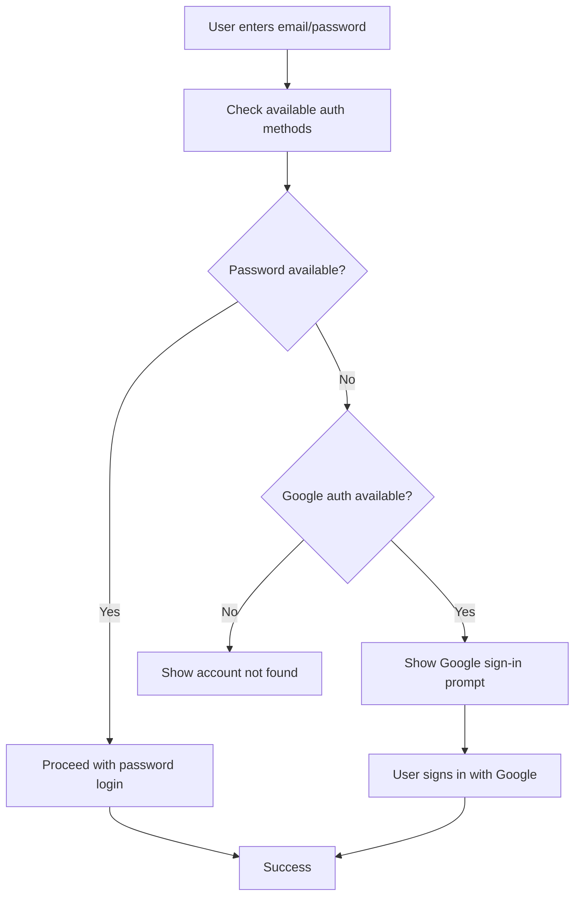
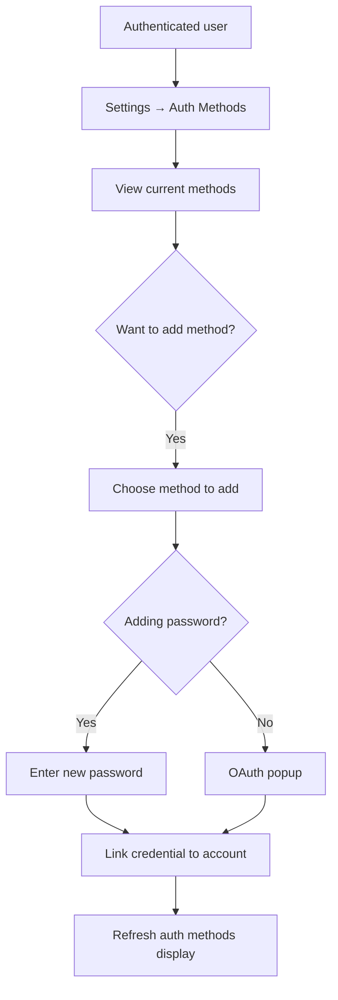

# Firebase Authentication Methods Management

This document explains how the Nexus Field Service Management application handles multiple authentication methods and account linking scenarios.

## Problem Statement

Firebase Auth supports multiple authentication providers (Google, email/password, Facebook, etc.), but users may initially sign up with one method and later need or want to use another. Common scenarios include:

1. **Google-only users**: User signs up with Google OAuth but has no password
2. **Account linking**: User wants to add password authentication to their Google account
3. **Forgotten sign-in method**: User forgets they signed up with Google and tries email/password
4. **Backup authentication**: User wants multiple ways to access their account

## Solution Architecture

### Core Components

1. **AuthMethodService** (`src/services/AuthMethodService.ts`)
   - Handles account linking and unlinking
   - Provides smart sign-in logic
   - Manages authentication method detection

2. **AuthMethodManager** (`src/components/AuthMethodManager.tsx`)
   - UI for managing authentication methods
   - Add/remove authentication providers
   - Change passwords for existing accounts

3. **Enhanced Login** (`src/pages/BasicLogin.tsx`)
   - Smart sign-in detection
   - Helpful error messages for authentication mismatches
   - Guidance to correct authentication method

## User Scenarios & Solutions

### Scenario 1: Google-only User Wants Password

**Problem**: User signed up with Google and wants to add password authentication.

**Solution**: 
1. User goes to Settings → Authentication Methods
2. Sees warning about having only Google sign-in
3. Clicks "Add Password Authentication"
4. Creates a password that gets linked to their existing account

```typescript
// Link password to existing Google account
await AuthMethodService.linkPasswordAuth(password);
```

### Scenario 2: User Forgets They Used Google

**Problem**: User tries to sign in with email/password but account only has Google auth.

**Solution**:
1. Smart sign-in detects authentication method mismatch
2. Shows helpful error with Google sign-in button
3. User clicks "Sign in with Google" instead

```typescript
// Smart detection during login
const result = await AuthMethodService.smartSignIn(email, password);
if (result.needsGoogleAuth) {
  // Show Google sign-in option
}
```

### Scenario 3: Account Linking

**Problem**: User wants multiple authentication methods for flexibility.

**Solution**:
1. User can link multiple providers to one account
2. Firebase automatically merges user data
3. User can sign in with any linked method

```typescript
// Link Google to existing email/password account
await AuthMethodService.linkGoogleAuth();
```

## Authentication Flow

### Smart Sign-In Process



### Account Linking Process



## Implementation Details

### Authentication Method Detection

```typescript
export interface AuthMethodsInfo {
  methods: AuthMethod[];
  hasPassword: boolean;
  hasGoogle: boolean;
  primaryEmail: string;
  canAddPassword: boolean;
}

const authInfo = AuthMethodService.getCurrentUserAuthMethods();
```

### Account Linking

```typescript
// Link password authentication
const result = await AuthMethodService.linkPasswordAuth(password);

// Link Google authentication  
const result = await AuthMethodService.linkGoogleAuth();

// Unlink authentication method
const result = await AuthMethodService.unlinkAuthMethod('google.com');
```

### Security Considerations

1. **Minimum Authentication**: Users must have at least one authentication method
2. **Reauthentication**: Password changes require current password verification
3. **Provider Validation**: Only accept credentials from trusted providers
4. **Domain Restrictions**: Ensure email domains match organization requirements

## User Experience

### Visual Indicators

- **Connected Status**: Green badges for linked authentication methods
- **Primary Method**: Special indicator for the default sign-in method
- **Security Warning**: Alert for users with only one authentication method
- **Add/Remove Actions**: Clear buttons for managing authentication methods

### Error Handling

- **Smart Error Messages**: Context-aware guidance for authentication issues
- **Recovery Suggestions**: Clear steps to resolve authentication problems
- **Fallback Options**: Alternative authentication methods when primary fails

## Settings Integration

### Navigation

Authentication Methods appears under "Your Account" in Settings:

1. Authentication Methods ← **New**
2. Billing
3. Company Profile
4. Feature Configurations
5. Marketing Registration
6. Register for Texting

### Security Section

The Authentication Methods section includes:

- **Current Methods**: List of linked authentication providers
- **Add Methods**: Interface to link additional providers
- **Security Status**: Warnings and recommendations
- **Password Management**: Change password for email/password accounts

## Best Practices

### For Users

1. **Add Backup Authentication**: Link multiple methods for account recovery
2. **Use Strong Passwords**: When adding password authentication
3. **Keep Methods Updated**: Remove unused authentication methods
4. **Remember Primary Method**: Note which method you typically use

### For Developers

1. **Handle All Scenarios**: Cover edge cases in authentication flows
2. **Provide Clear Feedback**: Show helpful error messages and guidance
3. **Security First**: Validate all authentication operations
4. **Test Thoroughly**: Verify all authentication method combinations

## Testing Scenarios

1. **Google-only User**: 
   - Sign up with Google only
   - Try to sign in with email/password
   - Add password authentication
   - Test both sign-in methods

2. **Email-only User**:
   - Sign up with email/password
   - Link Google account
   - Test both sign-in methods
   - Remove one method

3. **Mixed Authentication**:
   - User with both Google and password
   - Remove Google authentication
   - Verify password still works
   - Re-add Google authentication

## Troubleshooting

### Common Issues

1. **"Account already in use"**: Another user has claimed this authentication method
2. **"Provider already linked"**: Trying to link an already connected method
3. **"Requires recent login"**: User needs to reauthenticate before sensitive operations
4. **"Popup closed"**: User closed OAuth popup before completion

### Solutions

1. Check existing account ownership
2. Verify current authentication status
3. Prompt for reauthentication when required
4. Retry OAuth flow with proper error handling

## Future Enhancements

### Planned Features

1. **Multi-factor Authentication**: Add 2FA support
2. **Social Providers**: Support for Facebook, Twitter, etc.
3. **Enterprise SSO**: SAML/OIDC integration
4. **Biometric Auth**: Fingerprint/face recognition on mobile
5. **Session Management**: Control active sessions across devices

### Advanced Security

1. **Risk-based Authentication**: Detect suspicious sign-in attempts
2. **Device Trust**: Remember trusted devices
3. **Geographic Restrictions**: Limit sign-ins by location
4. **Audit Logging**: Track all authentication events

This authentication system provides a robust foundation for managing multiple authentication methods while maintaining security and excellent user experience. 